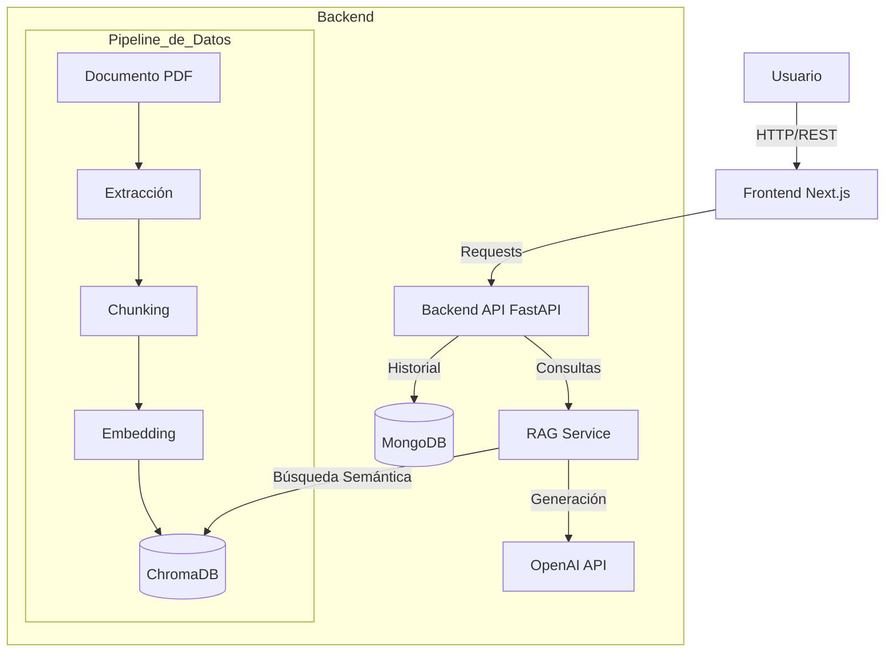
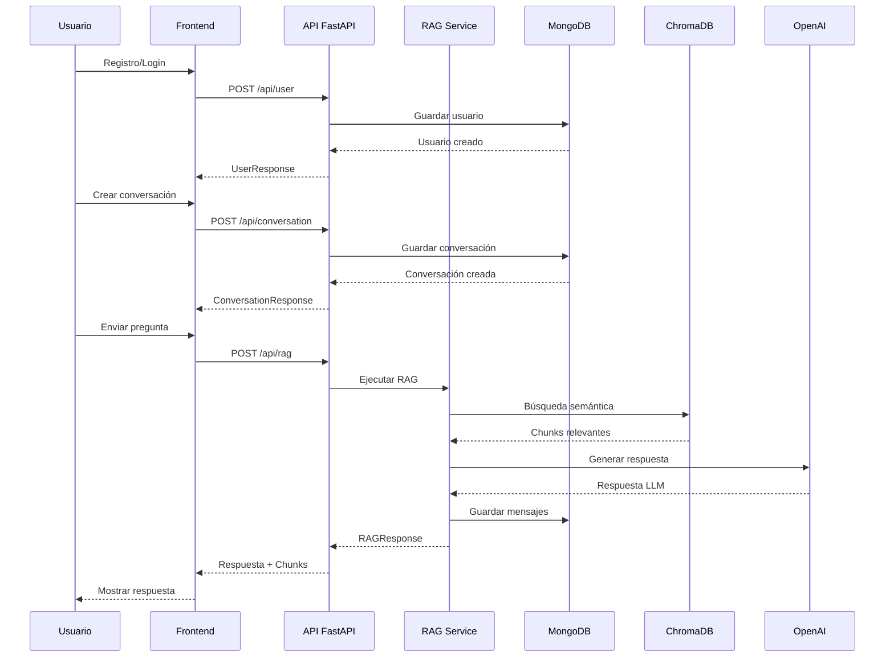

# 🧠 Domain-Specific Chatbot

**Asistente académico inteligente basado exclusivamente en el libro “Fundamentos de la Inteligencia Artificial: Una visión introductoria — Volumen I”.**

Este proyecto implementa un sistema **RAG (Retrieval-Augmented Generation)** para responder preguntas basándose únicamente en una fuente de conocimiento específica, evitando alucinaciones y garantizando la fidelidad de la información.

---

## 🎯 Objetivo del Proyecto

Desarrollar un chatbot conversacional capaz de:

1.  **Entender preguntas en lenguaje natural.**
2.  **Buscar y recuperar** los fragmentos más relevantes del libro en formato PDF.
3.  **Generar respuestas** basadas únicamente en el contenido recuperado.
4.  **Informar** cuando no existe contenido relevante en la base de conocimiento.

## 📚 Fuente de Conocimiento

El sistema utiliza como única fuente de verdad:

*   **Título:** "Fundamentos de la Inteligencia Artificial: Una visión introductoria — Volumen I"
*   **Editorial:** Puerto Madero
*   **Enlace:** [Puerto Madero Editorial](https://puertomaderoeditorial.com.ar/index.php/pmea/catalog/book/77)
*   **DOI:** [10.55204/pmea.77](https://doi.org/10.55204/pmea.77)

---

## 🏗️ Arquitectura del Sistema

El proyecto se divide en dos componentes principales: un **Backend** robusto que maneja la lógica de RAG y la API, y un **Frontend** moderno para la interacción con el usuario.

> **Nota:** Para visualizar los diagramas Mermaid en VS Code es necesario instalar
> la extensión *Markdown Preview Mermaid Support*:
> https://marketplace.visualstudio.com/items?itemName=bierner.markdown-mermaid




### 🔄 Flujo de Endpoints



### 🔧 Estructura del Backend

El backend está organizado en dos módulos clave:

1.  **Pipeline de Procesamiento (`backend/pipeline/`)**:
    *   Encargado de la ingesta y preparación de datos.
    *   **01_extraction.py**: Extrae texto del PDF.
    *   **02_chunking.py**: Divide el texto en fragmentos manejables.
    *   **03_embedding.py**: Genera vectores semánticos.
    *   **04_store_chroma.py**: Almacena los vectores en ChromaDB.
    *   **05_query_core.py** & **06_rag_response.py**: Módulos núcleo para la lógica de recuperación y respuesta.

2.  **API REST (`backend/api/`)**:
    *   Construida con **FastAPI**.
    *   Endpoints para usuarios, conversaciones, mensajes y RAG.
    *   Integra los servicios de base de datos y el servicio RAG.
    *   **Documentación interactiva:** http://localhost:8000/docs

### 💻 Frontend

*   Desarrollado con **Next.js**.
*   Interfaz de chat interactiva.
*   Visualización del documento fuente.
*   Registro e inicio de sesión simplificado (basado en email, sin verificación de contraseña en backend).

---

## 🚀 Instalación y Ejecución

### Prerrequisitos
*   Python 3.10+
*   Node.js 18+
*   MongoDB (corriendo localmente en puerto 27017)

### 1. Configuración del Backend

```powershell
# Navegar a la carpeta raíz
cd Domain-Specific-Chatbot

# Crear entorno virtual
python -m venv venv

# Activar entorno virtual (Windows)
venv\Scripts\activate

# Instalar dependencias
pip install -r requirements.txt

# Configurar variables de entorno
# (Asegúrate de tener tu .env con OPENAI_API_KEY y otras configuraciones necesarias)
```

**Ejecutar el Pipeline (Solo si es la primera vez o cambian los datos):**
Ejecuta los scripts en orden dentro de `backend/pipeline/` para procesar el PDF y poblar la base de datos vectorial.

**Iniciar el Servidor API:**

```powershell
# Opción 1: Script de inicio  (ESTA SI VALE)
python backend/start_api.py

# Opción 2: Uvicorn directo
uvicorn backend.api.main:app --reload --host 0.0.0.0 --port 8000
```
La documentación interactiva de la API estará disponible en: http://localhost:8000/docs

### 2. Configuración del Frontend

```powershell
# Navegar a la carpeta frontend
cd frontend

# Instalar dependencias
npm install

# Iniciar servidor de desarrollo
npm run dev
```
La aplicación estará disponible en: http://localhost:3000

---

## 🔐 Autenticación

El sistema utiliza autenticación simplificada:

- **Registro**: El usuario se registra con username, email y contraseña (mínimo 6 caracteres). La contraseña se valida en el frontend pero no se almacena en el backend.
- **Login**: El usuario inicia sesión con su email. El sistema busca el usuario por email en la base de datos. No hay verificación de contraseña en el backend.
- **Sesión**: El usuario se mantiene en el contexto de React y localStorage del navegador.

> **Nota**: Esta es una implementación simplificada para desarrollo. Para producción se recomienda implementar autenticación completa con JWT y hash de contraseñas.

---

## 🛠️ Tecnologías Utilizadas

*   **Lenguajes:** Python, TypeScript
*   **Frameworks:** FastAPI, Next.js
*   **IA / ML:** OpenAI API, LangChain (conceptos), PyMuPDF
*   **Bases de Datos:** ChromaDB (Vectorial), MongoDB (NoSQL)
*   **Herramientas:** Git, VS Code

---

## 📂 Estructura del Repositorio

```
Domain-Specific-Chatbot/
├── backend/
│   ├── api/
│   │   ├── db/              # Cliente MongoDB y repositorio
│   │   ├── models/          # Schemas Pydantic
│   │   ├── routers/         # Endpoints FastAPI
│   │   ├── services/        # Servicios (RAG, DB)
│   │   ├── config.py        # Configuración API
│   │   └── main.py          # Aplicación FastAPI
│   ├── pipeline/            # Scripts ETL y RAG Core
│   │   ├── 01_extraction.py
│   │   ├── 02_chunking.py
│   │   ├── 03_embedding.py
│   │   ├── 04_store_chroma.py
│   │   ├── 05_query_core.py
│   │   ├── 06_rag_response.py
│   │   ├── config.py
│   │   └── utils.py
│   └── start_api.py         # Entry point
├── frontend/
│   ├── app/                 # Páginas Next.js (App Router)
│   │   ├── chat/
│   │   ├── login/
│   │   ├── register/
│   │   └── layout.tsx
│   ├── components/          # Componentes React
│   │   ├── ui/              # Componentes UI (shadcn/ui)
│   │   ├── Chat.tsx
│   │   ├── ChatHistory.tsx
│   │   ├── PdfViewer.tsx
│   │   └── ...
│   ├── contexts/            # Contextos React (User, Conversation)
│   ├── lib/                 # Utilidades y cliente API
│   └── public/              # Archivos estáticos
├── data/                    # Datos procesados y ChromaDB
├── docs/                    # Documentación adicional
└── requirements.txt         # Dependencias de Python
```


- **Enlace:** https://github.com/Gonzalo-Romero-V/Domain-Specific-Chatbot.git


