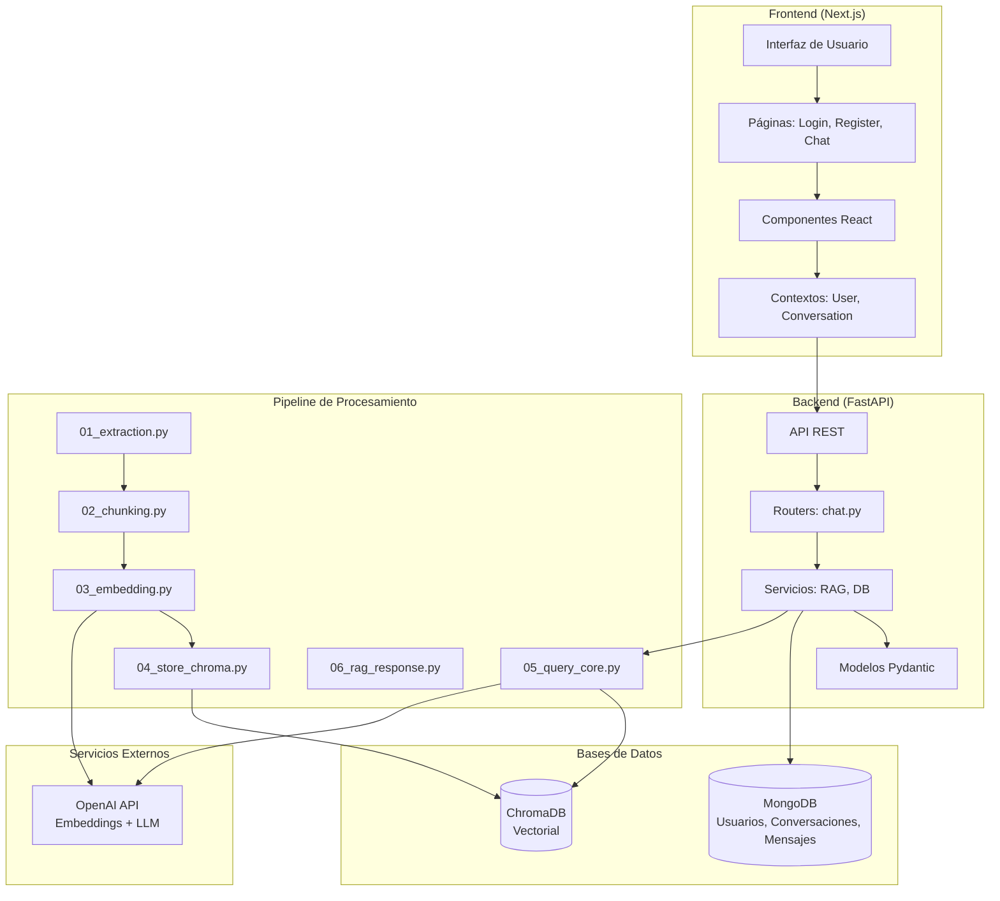
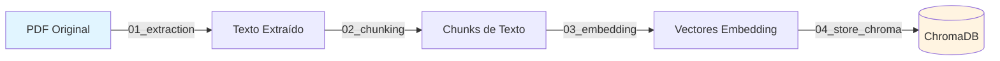
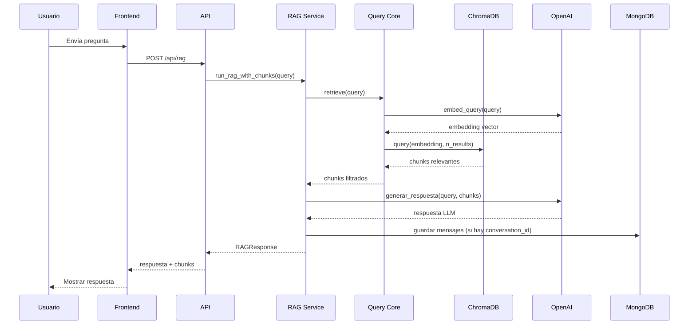

# 🏗️ Arquitectura del Sistema

Documentación técnica detallada de la arquitectura del Domain-Specific Chatbot.

## Visión General

El sistema implementa un chatbot RAG (Retrieval-Augmented Generation) especializado en responder preguntas sobre el libro "Fundamentos de la Inteligencia Artificial: Una visión introductoria — Volumen I".



## Componentes Principales

### 1. Frontend (Next.js)

#### Estructura
- **App Router**: Sistema de enrutamiento basado en carpetas
- **Componentes**: React components reutilizables
- **Contextos**: Gestión de estado global (UserContext, ConversationContext)
- **Lib**: Utilidades y cliente API

#### Páginas Principales
- `/` - Página de inicio
- `/login` - Inicio de sesión
- `/register` - Registro de usuarios
- `/chat` - Interfaz principal de chat

#### Componentes Clave
- `Chat.tsx`: Componente principal del chat
- `ChatHistory.tsx`: Historial de conversaciones
- `PdfViewer.tsx`: Visualizador del documento PDF
- `loginForm.tsx` / `registerForm.tsx`: Formularios de autenticación

### 2. Backend (FastAPI)

#### Estructura de la API

```
backend/api/
├── main.py              # Aplicación FastAPI principal
├── config.py            # Configuración (CORS, MongoDB, API prefix)
├── db/
│   ├── client.py        # Cliente MongoDB (singleton)
│   └── repository.py    # Operaciones CRUD
├── models/
│   └── schemas.py       # Schemas Pydantic (request/response)
├── routers/
│   └── chat.py          # Endpoints REST
└── services/
    ├── db_service.py    # Wrapper del repository
    └── rag_service.py   # Servicio RAG
```

#### Endpoints Disponibles

**Usuarios:**
- `POST /api/user` - Crear usuario
- `GET /api/user/{user_id}` - Obtener usuario por ID
- `GET /api/user/by-email/{email}` - Obtener usuario por email

**Conversaciones:**
- `POST /api/conversation` - Crear conversación
- `GET /api/conversation/{conversation_id}` - Obtener conversación
- `GET /api/user/{user_id}/conversations` - Listar conversaciones de usuario
- `DELETE /api/conversation/{conversation_id}` - Eliminar conversación

**Mensajes:**
- `POST /api/message` - Guardar mensaje
- `GET /api/conversation/{conversation_id}/messages` - Obtener mensajes

**RAG:**
- `POST /api/rag` - Ejecutar consulta RAG

**Básicos:**
- `GET /` - Endpoint raíz
- `GET /health` - Health check

### 3. Pipeline de Procesamiento

El pipeline procesa el PDF del libro en etapas secuenciales:



#### Etapas del Pipeline

**01_extraction.py**
- Extrae texto del PDF usando PyMuPDF (fitz)
- Procesa páginas específicas (0-212)
- Guarda texto en `data/01_extraction_output.txt`

**02_chunking.py**
- Limpia el texto (elimina títulos, números de página)
- Divide el texto en chunks de tamaño configurable
- Guarda chunks en `data/02_chunking_output.json`

**03_embedding.py**
- Genera embeddings usando OpenAI API (`text-embedding-3-large`)
- Procesa chunks en lotes
- Guarda embeddings en `data/03_embedding_output.jsonl`

**04_store_chroma.py**
- Crea colección en ChromaDB
- Almacena embeddings, documentos y metadatos
- Persiste en `data/04_store_chroma_db_output/`

**05_query_core.py**
- Genera embedding de la query
- Realiza búsqueda semántica en ChromaDB
- Filtra por distancia (threshold)
- Retorna chunks más relevantes

**06_rag_response.py**
- Orquesta el proceso completo RAG
- Combina recuperación (05) y generación (LLM)
- Genera respuesta usando GPT-4o-mini
- Aplica prompts del sistema configurados

### 4. Bases de Datos

#### MongoDB
Almacena datos estructurados:

**Colección: users**
```json
{
  "_id": ObjectId,
  "username": string,
  "email": string,
  "created_at": datetime
}
```

**Colección: conversations**
```json
{
  "_id": ObjectId,
  "user_id": string,
  "title": string,
  "created_at": datetime,
  "updated_at": datetime
}
```

**Colección: messages**
```json
{
  "_id": ObjectId,
  "conversation_id": string,
  "role": "user" | "assistant",
  "content": string,
  "created_at": datetime
}
```

#### ChromaDB
Base de datos vectorial para búsqueda semántica:

- **Colección**: `fundamentos_ia`
- **Espacio métrico**: Cosine similarity
- **Datos almacenados**:
  - IDs únicos
  - Embeddings (vectores)
  - Documents (texto original)
  - Metadatas (información adicional)

## Flujo de Datos RAG



## Configuración

### Variables de Entorno
- `OPENAI_API_KEY`: Clave de API de OpenAI (requerida)
- `MONGODB_URL`: URL de MongoDB (default: `mongodb://localhost:27017`)
- `MONGODB_DB_NAME`: Nombre de la base de datos (default: `rag_chatbot`)

### Parámetros del Pipeline
Configurados en `backend/pipeline/config.py`:
- `EMBEDDING_MODEL`: Modelo de embeddings (default: `text-embedding-3-large`)
- `LLM_MODEL`: Modelo LLM (default: `gpt-4o-mini`)
- `DEFAULT_N_RESULTS`: Número de chunks a recuperar (default: 8)
- `DISTANCE_THRESHOLD`: Umbral de distancia para filtrado (default: 0.7)
- `MAX_TOKENS`: Tokens máximos en respuesta (default: 350)
- `TEMPERATURE`: Temperatura del LLM (default: 0.4)

## Autenticación

Sistema de autenticación simplificado:

1. **Registro**: Usuario crea cuenta con username, email y contraseña (validada en frontend, no almacenada en backend)
2. **Login**: Usuario inicia sesión con email (búsqueda en MongoDB, sin verificación de contraseña)
3. **Sesión**: Usuario almacenado en React Context y localStorage

> **Nota**: Implementación básica para desarrollo. Para producción se requiere autenticación completa con JWT y hash de contraseñas.

## Tecnologías Utilizadas

### Backend
- **Python 3.10+**
- **FastAPI**: Framework web asíncrono
- **PyMuPDF (fitz)**: Extracción de texto PDF
- **OpenAI API**: Embeddings y generación de texto
- **ChromaDB**: Base de datos vectorial
- **MongoDB**: Base de datos NoSQL
- **Pydantic**: Validación de datos

### Frontend
- **Next.js 16**: Framework React con App Router
- **TypeScript**: Tipado estático
- **React 19**: Biblioteca UI
- **Tailwind CSS**: Estilos
- **shadcn/ui**: Componentes UI
- **react-pdf-viewer**: Visualizador PDF

## Consideraciones de Diseño

1. **Separación de responsabilidades**: Pipeline, API y Frontend son módulos independientes
2. **Modularidad**: Cada etapa del pipeline es un script independiente
3. **Configuración centralizada**: Parámetros en archivos `config.py`
4. **Manejo de errores**: Validación en múltiples capas (Pydantic, try-catch)
5. **Escalabilidad**: Arquitectura permite agregar más fuentes de conocimiento

